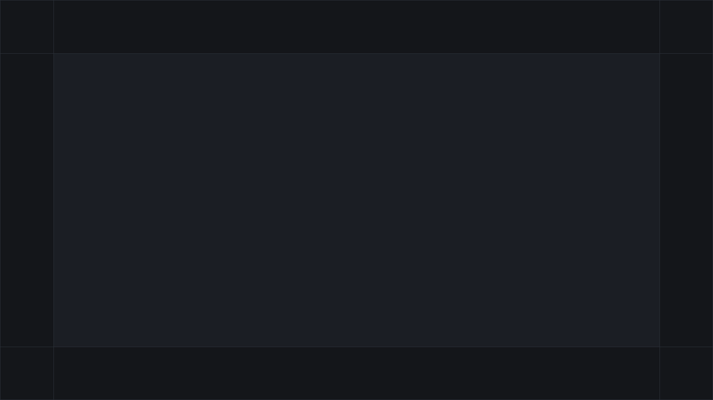

# ChillHub

[](https://github.com/tr0llex/chillhub/actions/workflows/lint.yml)
[](https://codecov.io/gh/tr0llex/chillhub)
[](https://launcher.samoy.love)

**Русский** · [English](README.en.md)

Лаунчер игр для Windows 10–11: раздача сборок с модами, автообновления и
новости. Сайт — **[launcher.samoy.love](https://launcher.samoy.love)**.

Обновить модпак должно значить «Обновить → Играть», а не «скачай архив,
распакуй сюда, эти три файла удали, а свой конфиг не потеряй». Ради этого всё и
затевалось.


## Обновления идут диффом

Сервер публикует манифест версии: путь каждого файла, размер и два хеша —
Blake3 и SHA-256. Клиент считает хеши того, что лежит на диске, и строит план:
что скачать, что удалить, какие пустые каталоги создать. После установки папка
игры — точная копия серверной версии, без «хвостов» от предыдущих сборок.

Скачивание идёт в 2–16 потоков через HTTP Range, недокачанное остаётся в
`.part` и переживает обрыв связи. Каждый файл принимается только после сверки
хешей. То же самое работает в обе стороны: переход на любую опубликованную
версию, включая откат назад, — тот же дифф, а не полная перекачка.

Проверка целостности в настройках пересчитывает хеши с диска мимо кеша и
показывает недостающие, повреждённые и лишние файлы; кнопка «Починить» отдаёт
получившийся план тому же механизму обновления.

Себя лаунчер обновляет отдельным exe: он копирует новые файлы, обходя
пользовательские (`config.json`, `launcher.version`), и перезапускает
приложение.

## Стек

**Клиент** — C# WPF на .NET 8. Публикуется self-contained, поэтому рантайма на
машине пользователя не требуется.

**Сервер** — Go, два независимых бинаря: публичный API (игры, версии,
манифесты, новости) и админский (приём ZIP-сборок, реестр игр, новости,
техработы, метрики, обратная связь). Оба слушают только loopback.

**Админка** — vanilla JS, без сборщика.

**Прод** — systemd за системным nginx, атомарные релизы с откатом через
[deploy-kit](https://github.com/tr0llex/deploy-kit).

## Из чего состоит

| Каталог | Что делает |
|---|---|
| `launcher/` | Клиент: обновления, запуск игр, новости, проверка целостности |
| `updater/` | Отдельный exe самообновления и правила сохранения пользовательских файлов |
| `server/cmd/api` | Публичный API |
| `server/cmd/admin` | Админ-API: приём сборок, активация `latest`, реестр, новости, техработы |
| `server/admin_ui/` | Веб-морда админки |
| `landing/` | Лендинг на корне домена |
| `content/` | Манифесты, файлы версий, новости, состояние техработ |

Один хост раздаёт всё: `/` — лендинг, `/api/*` — публичный API, `/admin/api/*`
и `/admin/ui/*` — админка, `/content/*` и `/downloads/*` — сборки, их отдаёт
nginx напрямую. Наружу смотрит только nginx.



## Установщик

Один exe на 57 МБ: NSIS, внутри self-contained сборка со всем рантаймом .NET.
Ставится в профиль пользователя (`%LOCALAPPDATA%\ChillHub`) за несколько секунд
и **не просит прав администратора**. WebView2 берётся из системы — в Windows 11 он есть всегда, а
на редких машинах без него bootstrapper дотягивает рантайм сам.

Пользовательские данные лежат отдельно от каталога установки, в
`%APPDATA%\ChillHub`, — иначе конфиг попадал бы в пакет обновления и давал
бесконечный цикл самообновления.

Подписи нет ни у манифестов, ни у исполняемых файлов: это осознанное решение.
Подлинность раздачи держится на TLS, а SmartScreen предупреждает при установке,
пока не наберётся репутация загрузок.

## Тесты

504 теста на клиенте (xUnit) и 363 на сервере (`go test -race`, покрытие 78%).
Красный прогон останавливает выкатку.

Отдельно закреплён стык двух языков: сервер считает хеши библиотекой Go, клиент
— библиотекой C#, и разъехавшиеся реализации не дали бы никакой ошибки — просто
каждый установленный лаунчер решил бы, что не совпадает ни один файл, и
перекачал бы игры целиком. Поэтому один и тот же эталонный вектор проверяется с
обеих сторон: `server/internal/adminapi/builds/hashvector_test.go` и
`launcher/tests/ChillHub.Tests/HashVectorTests.cs`.

Второй такой стык — манифест лаунчера против preserve-правил апдейтера: их
пересечение даёт бесконечный цикл самообновления. Проверка —
`dotnet run --project updater/tests/ManifestPreserveCheck`.

## Разработка

Нужны Go 1.26+, .NET 8 SDK и PowerShell 7.

```powershell
scripts\run-dev.ps1     # api + admin + клиент, три окна
scripts\run-admin.ps1   # только админка
scripts\run-client.ps1  # только клиент
```

Перед пушем — то же, что гоняет CI:

```powershell
cd server; go vet ./...; go test ./... -race
cd ..\launcher; dotnet test
```

## Выкатка

Четыре цели катятся по отдельности: лендинг, публичный API, админ-сервер и
морда админки. Установщик собирается только в CI и приезжает в GitHub Release.

```bash
dk deploy chillhub-api      # только публичный API
dk deploy --all --dry-run   # посмотреть план, ничего не трогая
dk rollback chillhub-admin
```

Из CI: Actions → Release → Run workflow, там же выбор цели. Тег `v*` катит всё
и собирает установщик в GitHub Release.

Пароль админки хранится хешем в systemd drop-in на сервере и задаётся отдельно
от выкатки: он меняется редко, а провозить секрет через каждый деплой — лишний
повод его потерять. Контент (сборки, новости, обращения) снимает
`deploy/backup-content.sh` по systemd-таймеру — этих данных нет больше нигде.

## Часть samoy.love

Домен читается как фамилия владельца — Самойлов; остальное вышло само собой.
Все проекты живут на одном хосте и катятся одним пайплайном.

| Проект | Что это |
|---|---|
| [launcher.samoy.love](https://launcher.samoy.love) | Этот лаунчер |
| [snakes.samoy.love](https://snakes.samoy.love) | Браузерная игра в захват территории — [tr0llex/snakes](https://github.com/tr0llex/snakes) |
| [metro.samoy.love](https://metro.samoy.love) | Офлайн-PWA со схемой московского метро — [tr0llex/metro-map](https://github.com/tr0llex/metro-map) |
| [status.samoy.love](https://status.samoy.love) | Статус сервисов: агент на хосте, бот в Telegram и внешний сторож — [tr0llex/status.samoy.love](https://github.com/tr0llex/status.samoy.love) |
| [samoy.love](https://samoy.love) | Личная страница — [tr0llex/samoy.love](https://github.com/tr0llex/samoy.love) |
| — | [metrics.samoy.love](https://github.com/tr0llex/metrics.samoy.love): туда собираются продуктовые метрики лаунчера — установки, дифф против полной загрузки, расхождения хешей |
| — | [deploy-kit](https://github.com/tr0llex/deploy-kit): общий релизный пайплайн для всех перечисленных |

## Дальше

Спецификация API, админки и клиента — [docs/spec.md](docs/spec.md),
переменные окружения сервисов — [docs/configuration.md](docs/configuration.md).
Задачи и планы — в [issues](https://github.com/tr0llex/chillhub/issues).

Связаться: [alex@samoy.love](mailto:alex@samoy.love).
