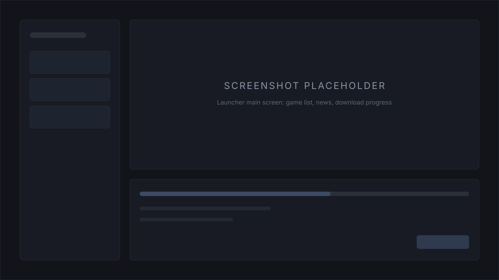

# ChillHub

[English](README.md) · Русский

[](https://github.com/tr0llex/chillhub/actions/workflows/ci.yml)
[](https://codecov.io/gh/tr0llex/chillhub)
[](https://launcher.samoy.love)
[](LICENSE)

Лаунчер для Windows, который раздаёт сборки игр с модами небольшому кругу
игроков и держит их в актуальном состоянии —
[launcher.samoy.love](https://launcher.samoy.love).

Обновить модпак должно значить «Обновить → Играть», а не «скачай архив,
распакуй сюда, эти три файла удали, а свой конфиг не потеряй». Каждый ручной
шаг в этой цепочке кто-нибудь однажды сделает не так, а сломанная установка
неотличима от сломанной сборки, пока в этом не разберутся руками.



## Как устроено

**Обновления идут диффом, потому что модпак меняется на считаные мегабайты.**
Сервер публикует манифест версии: путь каждого файла, размер и два хеша —
Blake3 и SHA-256. Клиент считает хеши того, что лежит на диске, и строит план:
что скачать, что удалить, какие пустые каталоги создать. В конце папка игры —
точная копия опубликованной версии, без «хвостов» от предыдущих сборок, а
переход на любую версию, включая откат назад, стоит того же диффа, а не полной
перекачки.

**Скачивание исходит из того, что связь оборвётся.** Файлы качаются в 2–16
потоков через HTTP Range (`SimpleSyncService.cs`), недокачанное остаётся в
`.part`, и после обрыва загрузка продолжается с того байта, на котором встала.
В папку игры файл попадает только после сверки хешей с манифестом — так
прерванная или побитая загрузка падает сразу, а не превращается в установку,
которая начнёт странно себя вести позже.

**Стык хешей между двумя языками закреплён тестами.** Сервер считает хеши
библиотекой Go, клиент — библиотекой C#. Разъехавшиеся реализации не дали бы
никакой ошибки: каждый установленный лаунчер просто решил бы, что не совпадает
ни один файл, и перекачал бы игры целиком. Поэтому один и тот же эталонный
вектор проверяется с обеих сторон.

**Себя лаунчер обновляет отдельным exe.** Запущенный процесс не может
переписать собственные файлы, поэтому `updater/` копирует новые, обходит
пользовательские (`config.json`, `launcher.version`) и перезапускает
приложение. Из-за этого же списка пользовательские данные живут в
`%APPDATA%\ChillHub`, а не рядом с бинарями: конфиг внутри каталога установки
попал бы в пакет обновления и дал бы бесконечный цикл самообновления — их
непересечение проверяется отдельно.

**Ничего не подписано, и это решение, а не упущение.** Подлинность держится на
TLS, а SmartScreen предупреждает при установке, пока не наберётся репутация
загрузок. Установщик остаётся пользовательским — NSIS с
`RequestExecutionLevel user` и установкой в `%LOCALAPPDATA%\ChillHub`, — чтобы
не просить прав администратора на чужой машине.

## Стек

**Клиент** — C# WPF на .NET 8. Публикуется self-contained, поэтому рантайма на
машине пользователя не требуется. Раздаётся одним установщиком NSIS, который
собирается в CI.

**Сервер** — Go, два независимых бинаря: публичный API (игры, версии,
манифесты, новости) и админский (приём ZIP-сборок, реестр игр, новости,
техработы, метрики, обратная связь). Оба слушают только loopback. Морда
админки — vanilla JS без сборщика.

**Прод** — systemd-юниты за системным nginx, атомарные релизы с откатом через
[deploy-kit](https://github.com/tr0llex/deploy-kit). Один хост раздаёт всё:
`/` — лендинг, `/api/*` — публичный API, `/admin/api/*` и `/admin/ui/*` —
админка, `/content/*` и `/downloads/*` — сборки, их отдаёт nginx напрямую.

## Быстрый старт

Нужны Go 1.26+, .NET 8 SDK и PowerShell 7.

```powershell
scripts\run-dev.ps1     # api + admin + клиент, три окна
scripts\run-admin.ps1   # только админка
scripts\run-client.ps1  # только клиент
```

Перед пушем — то же, что гоняет CI:

```powershell
cd server; go vet ./...; go test ./... -race
cd ..\launcher; dotnet test
```

## Структура

| Путь | Назначение |
|---|---|
| `launcher/` | Клиент: обновления, запуск игр, новости, проверка целостности |
| `updater/` | Отдельный exe самообновления и правила сохранения пользовательских файлов |
| `server/cmd/api` | Публичный API |
| `server/cmd/admin` | Админ-API: приём сборок, активация `latest`, реестр, новости, техработы |
| `server/admin_ui/` | Веб-морда админки |
| `landing/` | Лендинг на корне домена |
| `content/` | Манифесты, файлы версий, новости, состояние техработ |
| `scripts/` | Запуск для разработки, сборка установщика, NSIS-скрипт |
| `.deploy-kit/` | Описания целей выкатки |
| `docs/` | [Спецификация](docs/spec.md), [конфигурация](docs/configuration.md), [политика безопасности](docs/SECURITY.md) |

## Тесты

504 теста на клиенте (xUnit) и 377 на сервере (`go test -race`, покрытие 80%
по операторам). Красный прогон останавливает выкатку.

CI гейтит не только тесты: golangci-lint и `go vet` на Linux и на Windows,
кросс-сборка под linux/arm64 как на проде, `dotnet format
--verify-no-changes`, ESLint, Stylelint и HTMLHint для лендинга и админки,
`node --test` для функций экранирования в админке, govulncheck и проверка
NuGet-пакетов на уязвимости.

Два межъязыковых стыка проверяются отдельно: эталонный вектор хешей
(`server/internal/adminapi/builds/hashvector_test.go` и
`launcher/tests/ChillHub.Tests/HashVectorTests.cs`) и манифест лаунчера против
preserve-правил апдейтера
(`dotnet run --project updater/tests/ManifestPreserveCheck`).

## Выкатка

Четыре цели катятся по отдельности — лендинг, публичный API, админ-сервер и
морда админки — через [deploy-kit](https://github.com/tr0llex/deploy-kit).
Установщик собирается только в CI и приезжает в GitHub Release.

```bash
dk                          # что сейчас на проде
dk deploy chillhub-api      # только публичный API
dk deploy --all --dry-run   # посмотреть план, ничего не трогая
dk rollback chillhub-admin
```

Из CI: Actions → Deploy → Run workflow, там же выбор цели. Значение `all`
выкатывает четыре цели выше, но установщик НЕ собирает — для него нужен
отдельный запуск с `target=installer` либо тег `v*`, который делает и то и
другое.

Пароль админки хранится хешем в systemd drop-in и задаётся отдельно от
выкатки: он меняется редко, а провозить секрет через каждый деплой — лишний
повод его потерять. Контент — сборки, новости, обращения — снимает
`deploy/backup-content.sh` по systemd-таймеру; этих данных нет больше нигде.

## Часть samoy.love

Домен читается как фамилия владельца — Самойлов. Все перечисленные проекты
живут на одном хосте и катятся одним пайплайном.

| Проект | Что это |
|---|---|
| [launcher.samoy.love](https://launcher.samoy.love) | Этот лаунчер — [tr0llex/chillhub](https://github.com/tr0llex/chillhub) |
| [snakes.samoy.love](https://snakes.samoy.love) | Браузерная игра в захват территории — [tr0llex/snakes](https://github.com/tr0llex/snakes) |
| [metro.samoy.love](https://metro.samoy.love) | Офлайн-PWA со схемой московского метро — [tr0llex/metro-map](https://github.com/tr0llex/metro-map) |
| [status.samoy.love](https://status.samoy.love) | Статус сервисов: агент на хосте, бот в Telegram и внешний сторож — [tr0llex/status.samoy.love](https://github.com/tr0llex/status.samoy.love) |
| [samoy.love](https://samoy.love) | Личная страница — [tr0llex/samoy.love](https://github.com/tr0llex/samoy.love) |
| Мониторинг | [tr0llex/metrics.samoy.love](https://github.com/tr0llex/metrics.samoy.love) — мониторинг всей экосистемы; оба бинаря ChillHub отдают ему метрики в формате Prometheus на loopback |
| Пайплайн | [tr0llex/deploy-kit](https://github.com/tr0llex/deploy-kit) — общий релизный пайплайн для всех перечисленных |

## Контакты и лицензия

Алексей Самойлов — [alex@samoy.love](mailto:alex@samoy.love),
[t.me/tr0llex](https://t.me/tr0llex). Сообщения об уязвимостях —
[docs/SECURITY.md](docs/SECURITY.md). Задачи и планы — в
[issues](https://github.com/tr0llex/chillhub/issues).

MIT, см. [LICENSE](LICENSE).
